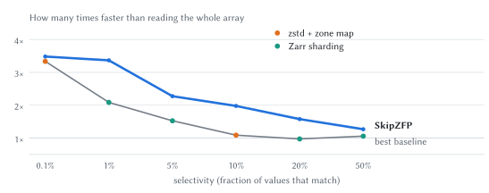
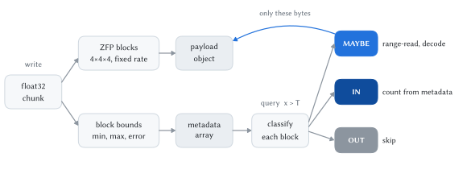

# SkipZFP

[](https://github.com/Juhani1104/SkipZFP/actions/workflows/ci.yml)
[](https://codecov.io/gh/Juhani1104/SkipZFP)
[](https://zarr-specs.readthedocs.io/en/latest/v3/core/index.html)
[](https://github.com/LLNL/zfp)
[](LICENSE)
[](https://github.com/astral-sh/ruff)

**Make ZFP-compressed arrays queryable.**

SkipZFP is a Zarr v3 codec for float32 scientific arrays. It stores data as
[ZFP](https://github.com/LLNL/zfp) fixed-rate blocks plus a few bytes of bounds per
block, so a query such as *count(x > T)* can tell which 4×4×4 blocks cannot match,
skip them without reading them, and decode only the blocks that might.

<p align="center">
  <picture>
    <source media="(prefers-color-scheme: dark)" srcset=".github/speedup-dark.svg">
    
  </picture>
</p>

<sub>Threshold queries (count of x > T) on ten years of hourly ERA5 temperature, 11.5 GB, read
from Google Cloud Storage.</sub>

- **Reads only what can match.** Fixed-rate blocks sit at computable offsets, so the
  planner turns the surviving blocks straight into byte-range requests.
- **Faster than every baseline, up to 50% selectivity.** On ten years of ERA5 2 m
  temperature in Google Cloud Storage, threshold queries beat the fastest baseline at
  every selectivity from 0.1% to 50% (1.04–1.82x) and a zstd full scan by 1.3–3.5x.
- **Small and standard.** Block bounds add 3.16% to an 8 bpv payload, and the arrays are
  ordinary Zarr v3 arrays with no side index.

## Installation

Requires [libzfp](https://github.com/LLNL/zfp) 1.0 and a C compiler.

```bash
git clone https://github.com/Juhani1104/SkipZFP.git
cd SkipZFP
pip install -e .
```

If libzfp is installed elsewhere, point to it:

```bash
ZFP_DIR=/path/to/zfp pip install -e .
```

## Quick start

```python
import numpy as np
import zarr
from skipzfp import SkipZFPCodec, query_gt, write_meta

# a smooth synthetic field: 256 hours on a 128 x 256 grid
t, y, x = np.meshgrid(np.arange(256), np.arange(128), np.arange(256), indexing="ij")
data = 280 + 10 * np.sin(x / 20) + 8 * np.cos(y / 15) + 3 * np.sin(t / 30)
data = data.astype("float32")

codec = SkipZFPCodec(rate=8, sub_chunk=(64, 16, 32), block_order=(1, 2, 0))
z = zarr.open_group("demo.zarr", mode="w").create_array(
    "t2m",
    shape=data.shape,
    chunks=(64, 128, 256),
    dtype="float32",
    serializer=codec,
    compressors=None,
)
z[:] = data

# per-block bounds, stored next to the array
write_meta(z, data)

# count(x > 295), reading only the blocks that can match
r = query_gt(z, 295.0)
print(r.count, r.bytes_read, r.maybe_blocks, r.total_blocks)
# 630563 588800 5056 131072
```

`query_gt` takes an opened Zarr array on any store (the experiments read from Google
Cloud Storage) or a path, and its result also reports bytes, requests and time per stage.

## How it works

<p align="center">
  <picture>
    <source media="(prefers-color-scheme: dark)" srcset=".github/how-it-works-dark.svg">
     T reads only the metadata, classifies each block
              as MAYBE (range-read and decode), IN (count from metadata) or OUT (skip)">
  </picture>
</p>

1. **Fixed-rate blocks.** Every 4×4×4 block compresses to exactly `rate × 64 / 8`
   bytes, so block *k* starts at a known offset and can be fetched with a range request.
2. **Block bounds.** For each block SkipZFP keeps its minimum and maximum, quantized to
   one byte each within the sub-chunk's range, plus the sub-chunk's largest
   reconstruction error, so the bounds hold for both the original and the decoded
   values.
3. **Three-valued planning.** A block is OUT (skip), IN (every value matches; count it
   from metadata) or MAYBE (read and decode). Nearby MAYBE blocks are merged into one
   request, and decoding runs in C while later requests are still downloading.
4. **Layout knobs.** `sub_chunk` packs several small units into one object for fewer
   requests; `block_order=(1, 2, 0)` stores each block column along time contiguously,
   which makes a point time series one range read; `layers` stores bit-plane prefixes so
   a query can read only a lower-rate prefix.

## Results

From the experiments in [`experiments/`](experiments). Query times come from an
n2-standard-16 VM (us-central1-b) reading from Google Cloud Storage; accuracy and
overhead are computed offline.

| Experiment | Headline |
|---|---|
| Threshold query | 1.04–1.82x faster than the best baseline (t2m, 0.1–50%) |
| Point query | 140 KB per query; chunked and sharded Zarr read 0.8–19 MB |
| Aggregates | error bounds never violated; sampling CIs miss up to 14% |
| Filtered aggregates | guaranteed COUNT interval from metadata alone |
| Overhead | 3.16% at 8 bpv |

## Reproducing the paper

| Level | Command | Needs |
|---|---|---|
| Redraw figures | `python experiments/figures.py` *(with the paper)* | this repo |
| Run the tests | `pytest` | this repo |
| Rerun everything | `BUCKET=gs://… bash experiments/run_cloud.sh` | a GCP VM and bucket |

On a Debian or Ubuntu VM you create, `run_cloud.sh` installs the dependencies, builds
libzfp, downloads ERA5 from the public
[ARCO-ERA5](https://github.com/google-research/arco-era5) store, writes every format to
your bucket, and runs each experiment. Every step can be rerun and resumes where it
stopped. The published results used an n2-standard-16 VM in us-central1-b.

<details>
<summary>Paper figure / table → script → result file</summary>

| Paper | Script | Result |
|---|---|---|
| Point query | `exp1_point_query.py` | `results/exp1_point_query.jsonl` |
| Threshold query | `exp2_threshold_query.py` | `results/exp2_threshold_query.jsonl` |
| Aggregates | `exp3_aggregate.py` | `results/exp3_aggregate.json` |
| Filtered aggregates | `exp4_filtered_aggregate.py` | `results/exp4_filtered_aggregate.json` |
| Metadata overhead | `exp5_overhead.py` | `results/exp5_overhead.json` |
| Object-size sensitivity | `sensitivity_object_size.py` | `results/sensitivity_object_size.jsonl` |
| README figure | `readme_figure.py` | `.github/speedup-*.svg` |
| README diagram | `readme_diagram.py` | `.github/how-it-works-*.svg` |

</details>

## Repository layout

```
skipzfp/        codec, query planner, and the C core (csrc/)
tests/          pytest suite, including direct tests of the C API
experiments/    data download, experiments, results, cloud runner
```

## Limitations

- float32, 3D arrays only; the array shape must be a whole number of chunks.
- NaN and infinite values are rejected (ZFP cannot encode them).
- Queries are `x > T` counts; other predicates and aggregates live in the experiments.

## Citation

A paper describing SkipZFP is in preparation.

## License

BSD 3-Clause. See [LICENSE](LICENSE).
